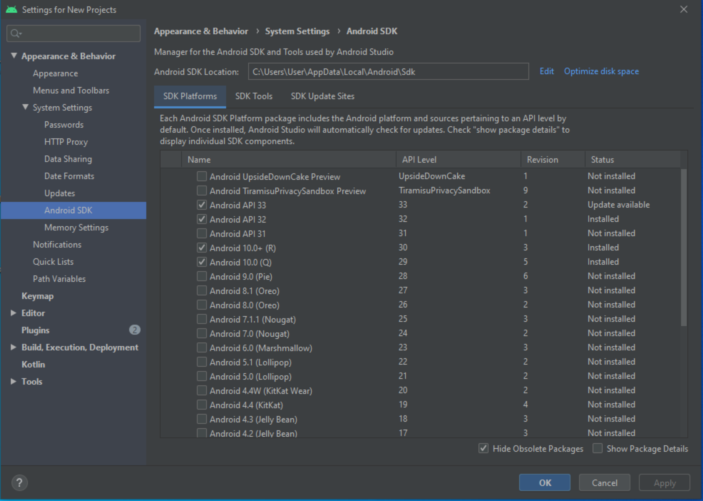

# Welcome to the Virtual Reality mobile application named ARProject1🦆

An application that is in charge of taking a specific image through Images Target and once the device manages to detect said image, the application will proceed to show a 3D design, in this case which would be a red duck 🦆

# Project features 🚨:
  *** Unity version: 2021.3.18f1***  
  ***UnityHub version: 3.4.1***  
  ***Android Studio version: 4.0***  
##  ***Image Target: 🖼***  

  

## ***Model 3D: 🗿***  

   

# Steps to run the project 🚨:

> 1.- Once the project is downloaded, you must have the three fundamental programs installed such as ***UnityHub***, ***Unity*** and ***Android Studio***. Preferably the previously commented versions in this same document.

> 2.- Once we have downloaded the programs, we proceed to configure the Android Studio program, we go to Configure and then to SDK Manager.
>> NOTE: In this link you can find a step by step to download and install Android Studio. [Link](https://docs.unrealengine.com/5.0/en-US/how-to-set-up-android-sdk-and-ndk-for-your-unreal-engine-development-environment/)

   

> 3.- We proceed to configure the SDK Platforms and SDK Tools sections taking into account the versions of each installed element (to see the versions check the Show Package Details box)

 References of the different versions of the different plugins or elements 

 

  
  

  ## More info about me: 

Ing. Kevin J. Montero Zea 

CE: 004712881 🆔

+51-913-695-382 📱

<a href="https://www.linkedin.com/in/kevin913montero/">
    LinkedIn 👨‍🦰
  </a>

<a href="https://portfoliokjmz.netlify.app/">
    Portfolio 💼
  </a>

